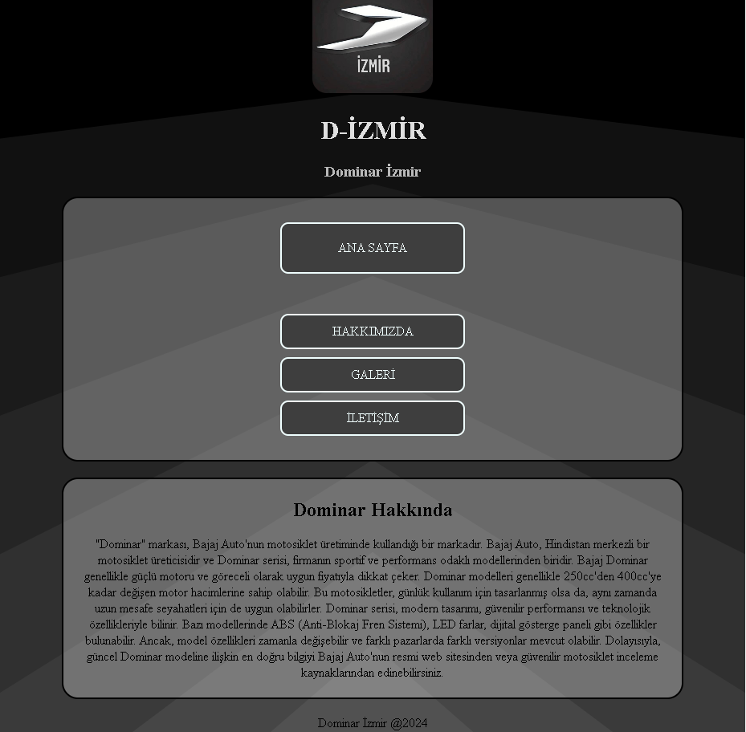

# Hobi Sitesi Tasarımı
Bu proje, HTML ve CSS kullanılarak basit bir hobi sitesi tasarımını içerir. Sitenin dört ana bölümü bulunmaktadır: başlık, menü, içerik alanı ve altbilgi.

## İçerik
Başlık Bölümü:

Sitenin adı ve logo şeklinde bir resim yer alır.
## Menü Bölümü:

Ana Sayfa, Hakkımızda, Galeri, İletişim gibi farklı sayfalara yönlendiren bağlantılar bulunur.
## İçerik Alanı:

Hobi ile ilgili kısa bir yazı ve görsel içerir.
## Altbilgi Bölümü:

İletişim bilgileri ve telif hakkı bildirimi bulunur.

